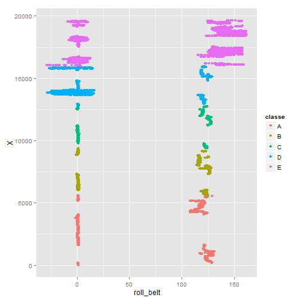

Prediction on Weight lifting Exercise data set
========================================================

In this project, I have trained a random forest model on the dataset. 

Data Import and Split into training and validation sets
========================================================
* The dataset was obtained as a csv file from the source and imported into R using import Dataset in R studio.
* As there was no test set with labelled examples, I first split the data into training and validation sets.

```r
library(caret)
```

```
## Warning: package 'caret' was built under R version 3.0.3
```

```
## Loading required package: lattice
## Loading required package: ggplot2
```

```
## Warning: package 'ggplot2' was built under R version 3.0.3
```

```r
pml.training <- read.csv("C:/Users/saswatac/Downloads/pml-training.csv")
pml.testing <- read.csv("C:/Users/saswatac/Downloads/pml-testing.csv")
inTrain = createDataPartition(y = pml.training$classe, p = 0.8, list = FALSE)
trainingSampples = pml.training[inTrain]
validationSampples = pml.training[-inTrain,]
```

Data Exploration
=================
* From the training set, I selected the 28 features with no missing values-

```r
trainingFeatures = trainingSampples[c("roll_belt", "pitch_belt", "yaw_belt", "gyros_belt_x", "gyros_belt_y", "gyros_belt_z", "accel_belt_x", "accel_belt_y", "accel_belt_z", "magnet_belt_x", "magnet_belt_y", "magnet_belt_z", "roll_arm", "pitch_arm", "yaw_arm", "total_accel_arm", "gyros_arm_x", "gyros_arm_y", "gyros_arm_z", "accel_arm_x", "accel_arm_y", "accel_arm_z", "magnet_arm_x", "magnet_arm_y", "magnet_arm_z", "roll_dumbbell", "pitch_dumbbell", "yaw_dumbbell")]
```
* Did some preliminary plots for each of these features. For example

```r
qplot(roll_belt, X, color = classe, data = pml.training)
```

 
* I discovered that certain features like roll_belt, pitch_belt, yaw_belt, accel_belt_x etc. were modal, and could be transformed into categorical variables like high, low, medium.
* magnet_belt_x and accel_belt_x were correlated.

Model Building
===============
* I first decided to try random forest without any preprocessing and using default settings. 

```r
# vanilaRfModel = train (x= trainingFeatures, y = trainingSampples$classe, method = "rf")
```
* The training results looked promising

```r
#vanilaRfModel$results
#  mtry  Accuracy     Kappa  AccuracySD     KappaSD
#1    2 0.9765968 0.9703886 0.002394119 0.003043853
#2   15 0.9768968 0.9707720 0.002162413 0.002756254
#3   28 0.9675826 0.9589989 0.004002836 0.005048018
```
* The accuracy on the validation set was good too!
confusionMatrix(validationSampples$classe, predict(vanilaRfModel, validationFeatures))
Accuracy across all classes was 98%!
* So this meant the **expected out of sample error** is 2%.
* Confident with these values, I used this model to predict the 20 test cases and achieved 100% acuracy.
